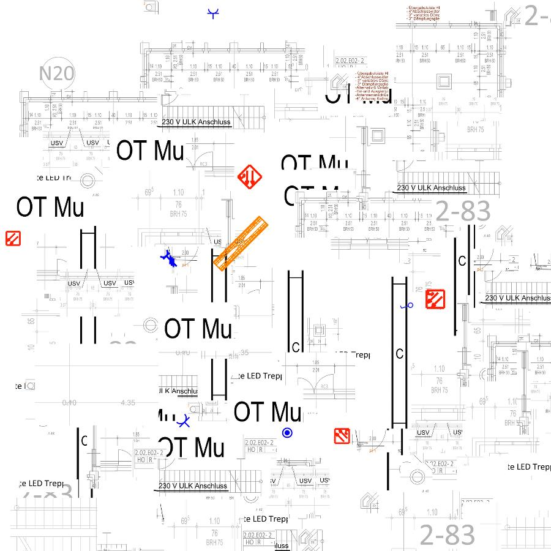
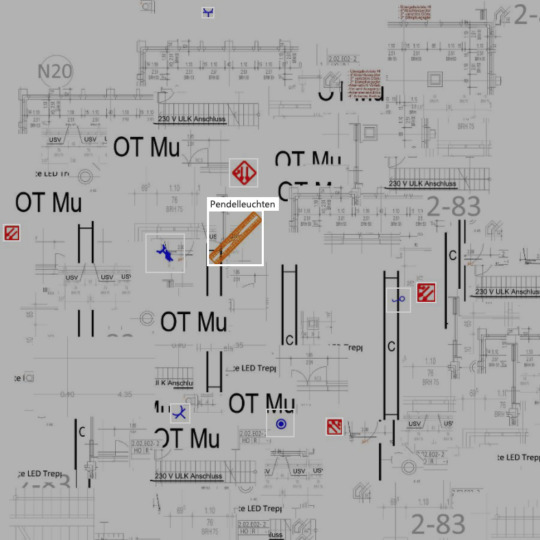

# DigiTecten ML

Zum Trainieren des Netzes generieren wir aus zuvor durch den Nutzer ausgewählten Piktogrammen Trainingsdaten. Dazu erzeugen wir Bilder die im Hintergrund aus "Rauschen" bestehen. Dazu haben wir zuvor aus den Bauplänen Screenshots gesammelt die keine auffälligen Symbole enthalten.
Anschließend werden die zu identifizierenden Symbole zufällig auf dem Bild verteilt. Die Symbole werden außerdem zufällig permutiert (rotation in 45° Schritten und leichte Verzerrungen). Die so erzeugten Bilder können zum Beispiel wie folgt aussehen:

Da die Piktogramme automatisch platziert wurden können wir auch direkt Labels zuweisen um später einen Machinelearning Algorithmus zu trainieren:

Bild und Labels werden per API an Azure CustomVisionAI gesendet und einem Projekt zugeordnet.

Sind ausreichende Mengen an Trainingsdaten erzeugt kann das Modell trainiert werden. Im Falle von CustomVisionAI kann das in Zukunft nach Auswahl neuer Piktogrammtypen über die API angestoßen werden. Im Rahmen des Hackathons haben wir ein solches Modell trainiert und getestet: test.js

Das Modell kann über die API zur evaluierung spezieller Bildausschnitte verwendet werden: predict.js
